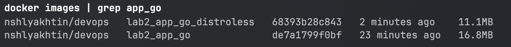

# Docker Implementation Details

## Best Practices Applied

- Right base image. `Dockerfile` uses Docker Official Images for golang and alpine
- Exclude irrelevant filed with `.dockerignore`
- Using `USER` to create a new non-root user for running the application without unnecessary privileges
- Use `COPY` with specific files, which are essential for running the application
- Specify precise version tag for base images - golang 1.23 and alpine 3.19
- Minimize number of layers in `Dockerfile` and order layers from least to most frequently changed for efficient caching
  and container rebuild
- Used `hadolint` linter for `Dockerfile`

## Multi-Stage Build Utilization

In this case Multi-Stage Build is a perfect solution:

- Stage 1: download necessary application dependencies and build the binary executable with `go build`
- Stage 2: run the executable on lightweight VM with only single binary executable file

After moving to Stage 2 docker will automatically delete heavy VM from Stage 1 with all downloaded dependencies.
The prebuild image will be lightweight because it will contain only final binary executable file.

## Distroless Image Version

The `distroless.Dockerfile` contains distroless version of Dockerfile. The Stage 1 is the same.
However, at Stage 2 now we use special distroless runtime instead of alpine. This provides small and lightweight
image without OS.

Distroless image is smaller and more secure.
The container does not have OS, shell access, package manager and access to the root user.
Distroless base images also have additional security controls from Google.

The following image shows the size different between regular and distroless images for Go application:

