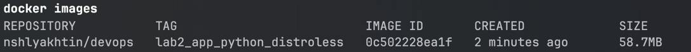
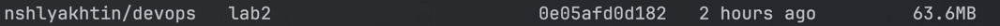

# Docker Implementation Details

## Best Practices Applied

- Right base image. `Dockerfile` uses Docker Official Images for python and alpine
- Exclude irrelevant filed with `.dockerignore`
- Using `USER` to create a new non-root user for running the application without unnecessary privileges
- Use `COPY` with specific files, which are essential for running the application
- Specify precise version tag for base images - python 3.19 and alpine 3.15
- Minimize number of layers in `Dockerfile` and order layers from least to most frequently changed for efficient caching
  and container rebuild
- Used `hadolint` linter for `Dockerfile`

## Distroless Image Version

The `distroless.Dockerfile` contains distroless version of Dockerfile.

Distroless image is smaller and more secure.
The container does not have OS, shell access, package manager and access to the root user.
Distroless base images also have additional security controls from Google.

The following images show the size difference between regular and distroless images for Python application:

