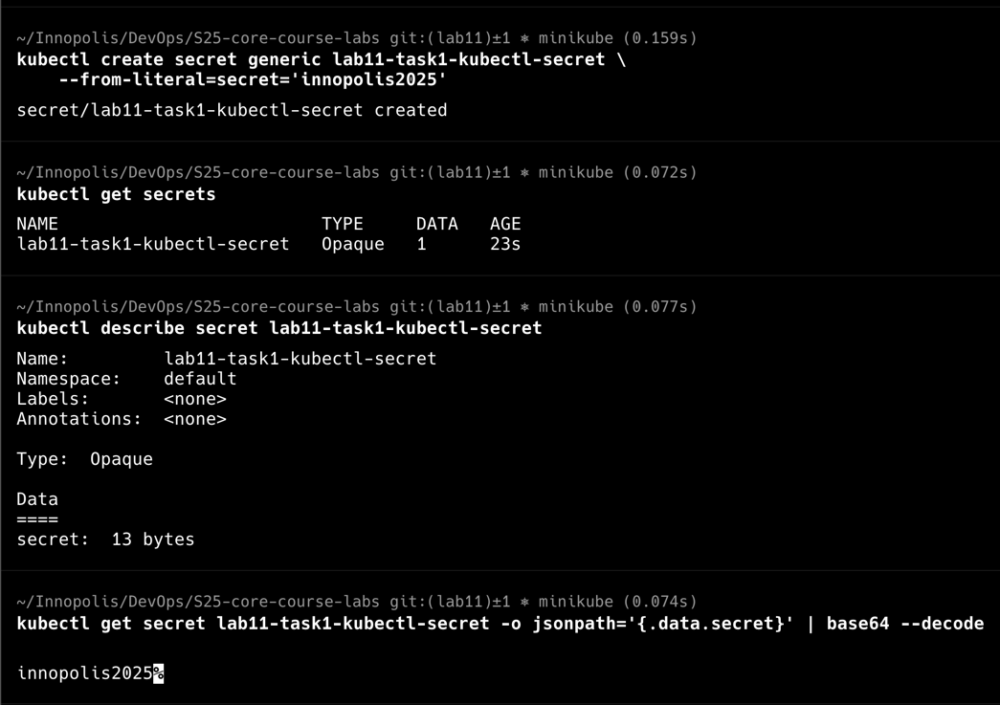
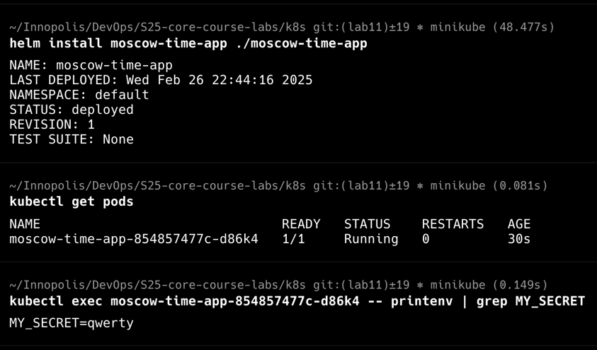
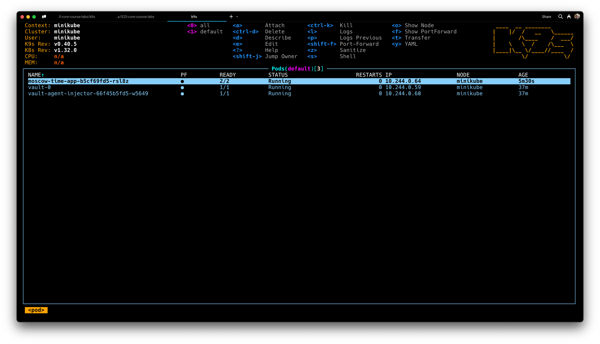
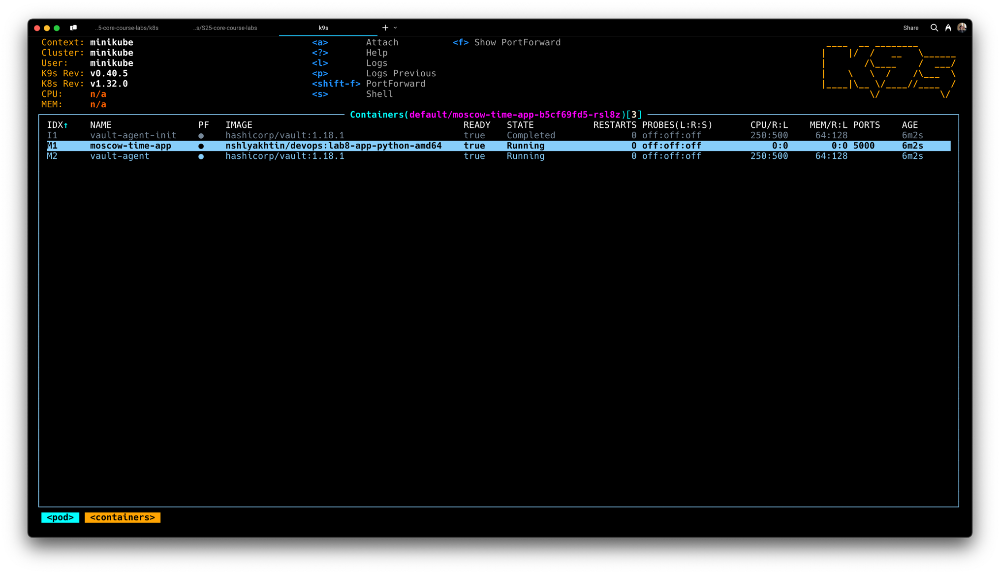
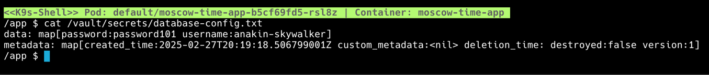
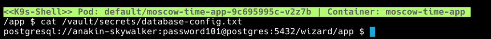

# Lab 11: Kubernetes Secrets and Hashicorp Vault

## Task 1: Kubernetes Secrets and Resource Management

## Using Kubernetes Secrets with `kubectl`

The following screenshot demonstates that I successfully created and read the secret `lab11-task1-kubectl-secret` from
Kubernetes Secrets using `kubectl`:

## Managing secrets with Helm

The following screenshot demonstates that I successfully created and read the secret 'MY_SECRET' from Pod
using `kubectl` and Helm:

## Task 2: Vault Secret Management System

The following screenshots demonstrate that I successfully installed and configured Vault using Helm Chart and
injected `database-config.txt` file with secrets `username:anakin-skywalker` and `password:password101`.

Screenshots demonstrate k8s pods for my `moscow-time-app` and `vault`, containers for `moscow-time-app` and `vault`
inside application pod and secrets data from application container shell.

Note: In the folllowing screnshots I use `k9s` CLI tool instead of `kubectl` to retrieve information about pods and
connect to their containers to use the shell.

THe following screenshot demonstrates that I applied the template and structured the `username` and `password`
data for `database-config.txt` as a DSN string. If I try to read the secret from `moscow-time-app` container
I will get the structured DSN instead of map with `username` and `password`:

