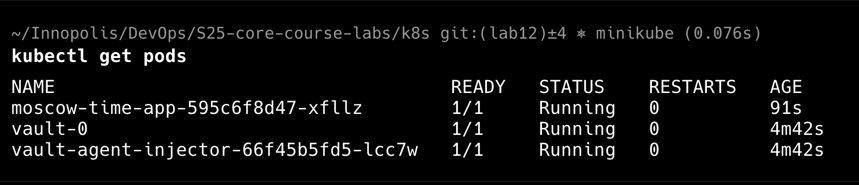
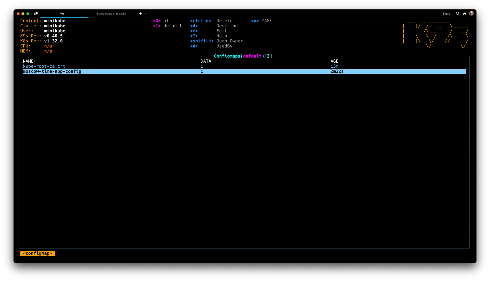
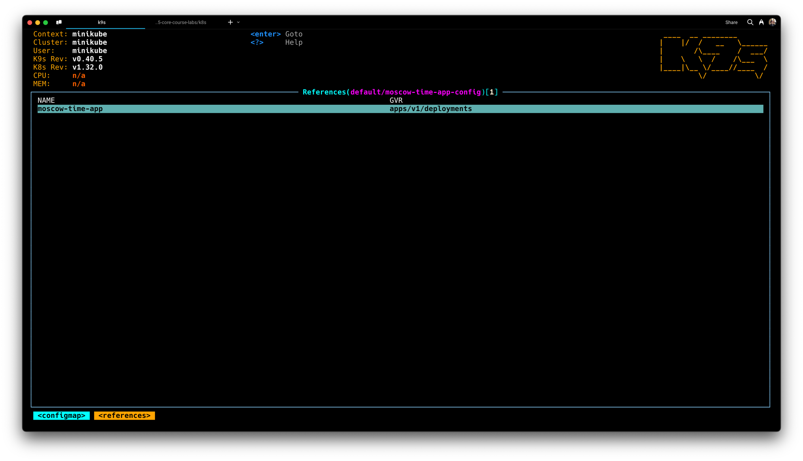
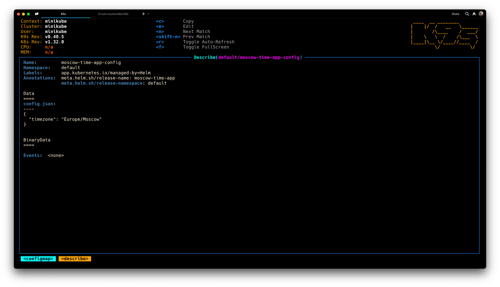
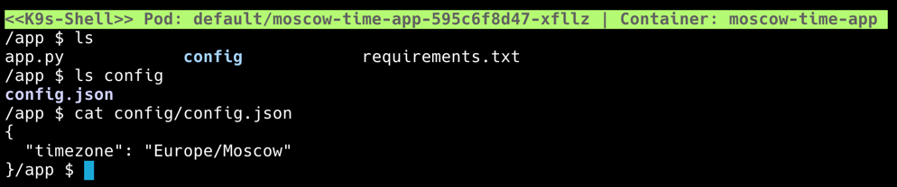

# Lab 12: Kubernetes ConfigMaps

## Task 2: ConfigMap Implementation

The following screenshots demonstrate that I successfully added ConfigMap
configuration to my Helm Chart template with configuration
variables read from `files/config.json`.

The screenshots demonstrate:

- active ConfigMaps,
- references for `moscow-time-app-config` ConfigMap
- the output of `describe` for `moscow-time-app-config` ConfigApp
    with full `config.json` configuration file
- file structure inside `moscow-time-app` container and
    content or `config.json` file from inside the container

On the screenshots I use `k9s` CLI tool for easier interaction with
k8s cluster and its objects.

