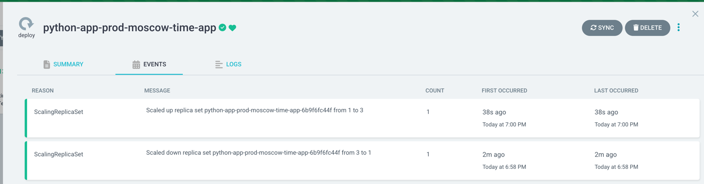
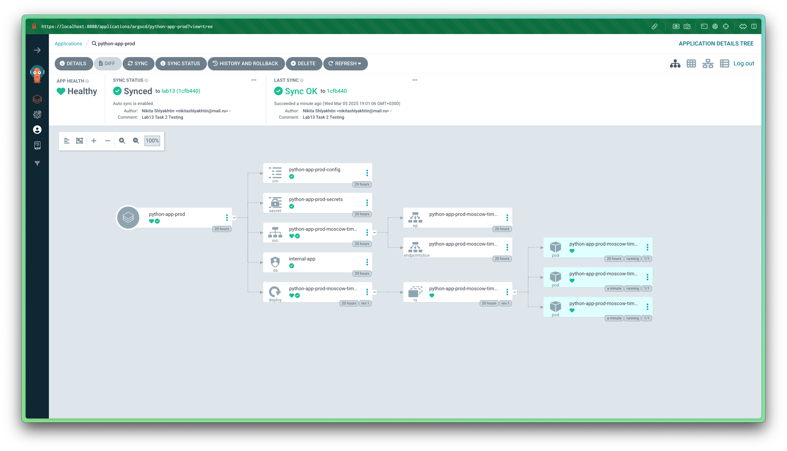
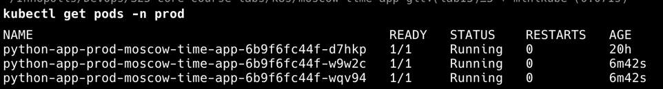
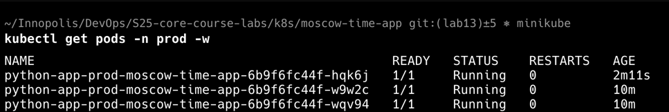
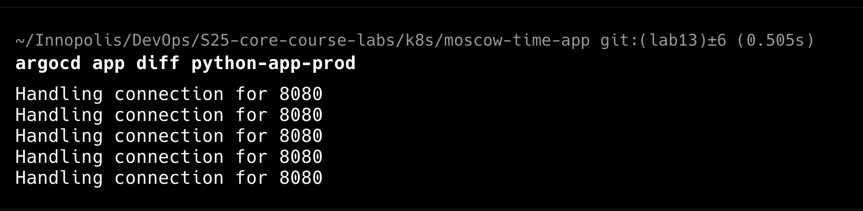
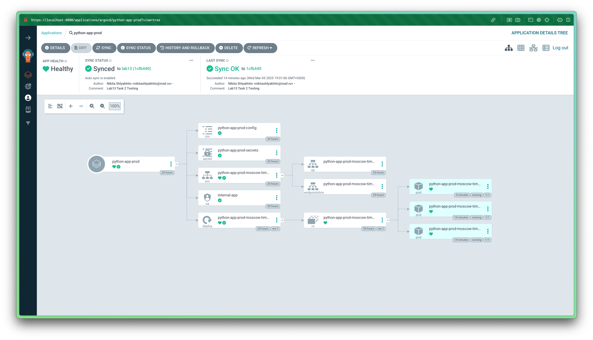

# Lab 13: ArgoCD for GitOps Deployment

NOTE: The default number of Pods for `moscow-time-app` Deployment in `prod` Namespace
is `3` in my configuration.

## Test 1: Manual Override of Replica Count

The following screenshots demonstate the result of manually changing replica count on
k8s deployment `python-app-prod` from 3 to 1.

It is clear from the event log that we firstly changed replica count manually from 3 to 1,
then ArgoCD found inconsistency with `values-prod.yaml` config from git and rescaled the replicas
back to 3:

## Test 2: Delete a Pod (Replica)

List of Pods from `prod` k8s namespace before deletion:

List of Pods from `prod` k8s namespace after deletion of the oldest pod
with `AGE=20h` (2 other Pods were recreated during Test 1):

It is clear from the screenshot above that after deletion of 1 Pod ArgoCD
automatically detected inconsistent state and recreated the Pod.

The following 2 screenshots demonstate the final dashboard for `prod` app
and that there is no drift in ArgoCD:

## How ArgoCD handles configuration drift vs. runtime events

ArgoCD handles configuration drift by continiously comparing the desired state in Git
(e.g., number of replicas in `values` files as in my example) with the actual desired state in k8s and automatically making
changes to move the system to desired state from Git (if auto-sync is enabled).

For runtime events, like a pod being deleted in our test, ArgoCD doesn’t make changes because it’s
managed by k8s controllers (e.g., Deployment), not Git config files, so it only cares about the desired k8s state staying synced with desired state in Git.
