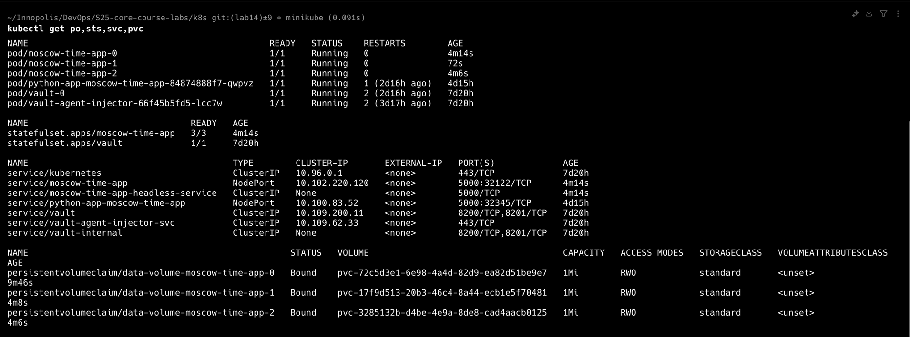
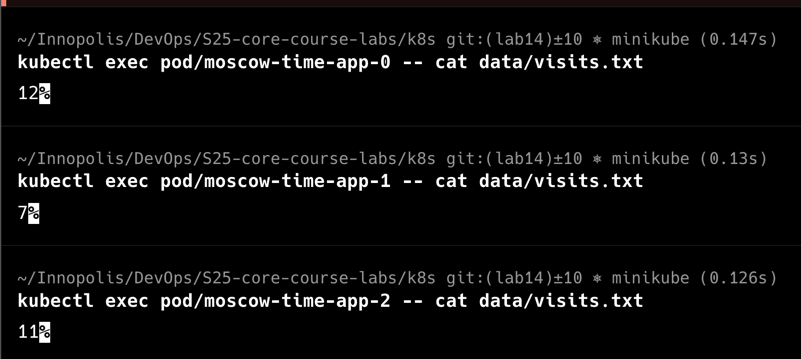
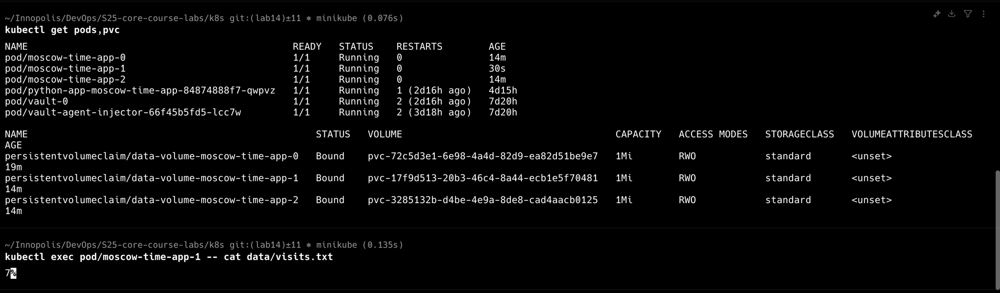
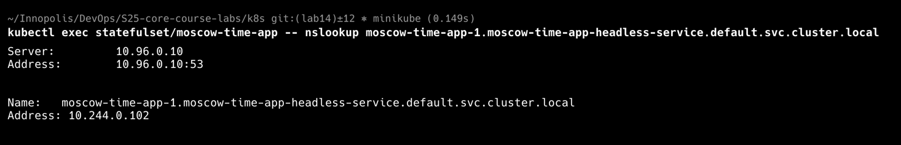

# Lab 14: Kubernetes StatefulSet

## Task 2: StatefulSet Exploration and Optimization

### Research and Documentation

Output of `kubectl get po,sts,svc,pvc` for `default` namespace:

Visits count for different Pods:

The screenshots demonstrate that I created a StatefulSet resource for `moscow-time-app` with
3 Pods. Each pod have its own 1Mi PersistentVolumeClaim, which are bound to different volumes.

This is the reason why 3 Pods have different `visits.txt` file content: Service resource, which I use
to access application from outside the k8s cluster, distributes requests between 3 Pods in a StatefulSet,
and each Pod saves its `visits.txt` file in its own PersistentVolume.

### Persistent Storage Validation

The screenshot demonstrate that visits data persists between pods deletion.

I deleted the pod `pod/moscow-time-app-1`, which previously had visits count=7. It is clear that the pod
was deleted and recreated from age=30s stat, which differs from age=14m on pod 0 and pod 1. It is also clear
that the PVC for deleted pod wasn't deleted (age=14m) and the visists count remain the same as before the deletion.

### Headless Service Access

The screenshot demonstrate DNS resolution for pod `pod/moscow-time-app-1` in `moscow-time-app`
StatefulSet:

Here’s an improved version of your text with better grammar, clarity, and flow, while keeping it simple:

### Monitoring & Alerts

For simplicity, I configured both the `livenessProbe` and `readinessProbe` to use the root `/` endpoint of my
`moscow-time-app` application.

The `livenessProbe` keeps pods healthy by restarting them if they crash, while the
`readinessProbe` makes sure only healthy pods get traffic.

The `readinessProbe` checks if the application is ready to receive traffic: Kubernetes sends a request to the readiness
endpoint, and if it fails, the service excludes the pod from incoming traffic until the app is ready.

The `livenessProbe` ensures the application is alive: Kubernetes requests the liveness endpoint, and if the request
fails, Kubernetes restarts the pod.

Why they’re critical for stateful apps: Stateful apps need stable pods to avoid data loss, so probes help catch
issues early and keep application running as expected.

### Ordering Guarantee and Parallel Operations

Why ordering guarantees are unnecessary for my app: My `moscow-time-app` doesn’t care about pod order since each pod
tracks its own visits in `visits.txt` and doesn’t need to talk to other pods.

How I made pods launch or terminate in parallel: I set `podManagementPolicy: Parallel` in the StatefulSet spec,
which tells Kubernetes to handle all pods in parallel without strict StatefulSet order.
