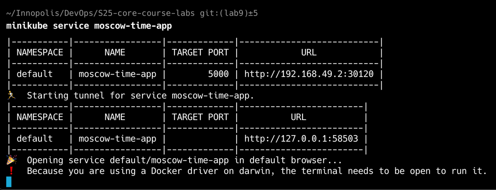

# Kubernetes

## Lab 9: Introduction to Kubernetes

## Task 1: Kubernetes Setup and Basic Deployment

In this task, I:

- installed `kubectl` and `minikube` for managing Kubernetes:
  
- created a  `moscow-time-app` `Deployment` for `app_python`
  with `nshlyakhtin/devops:lab8-app-python-amd64` Docker image from Docker Hub:
  
- created a `Service` to access application from outside k8s cluster network:
  
  
  
- removed the created `Deployment` and `Service` resources:
  

## Task 2: Declarative Kubernetes Manifests

In this task I created a `Deployment` and `Service` with manifest files:

## Bonus Task: Additional Configuration and Ingress

In this task I added the `Deployment` and `Service` manifest files for my app_go crypto-price-tracker app
and added `Ingress` manifest to expose 2 apps (app_python and app_go) from k8s cluster network:

The apps can be accessed with `localhost` base URL and `/time` endpoint to access `moscow-time-app`
or `/crypto/price` to access `crypto-price-tracker`. It is important to note that applications are accessed
through `minikube tunnel` because of `Docker Desktop` limitations on `MacOS`:

