# Helm

## Lab 10: Introduction to Helm

## Task 1: Helm Setup and Chart Creation

The following screenshots demonstrate that I successfully installed Helm, configured Helm Chart for `moscow-time-app`
and installed Helm Chart on my Minikube cluster:

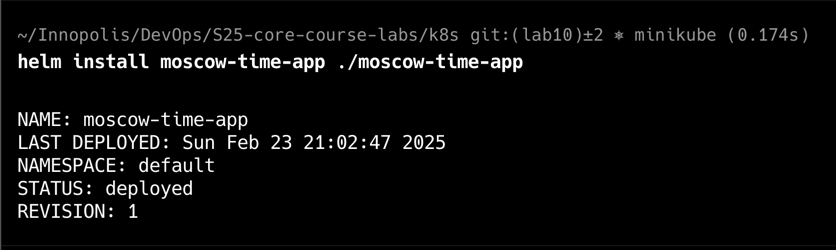

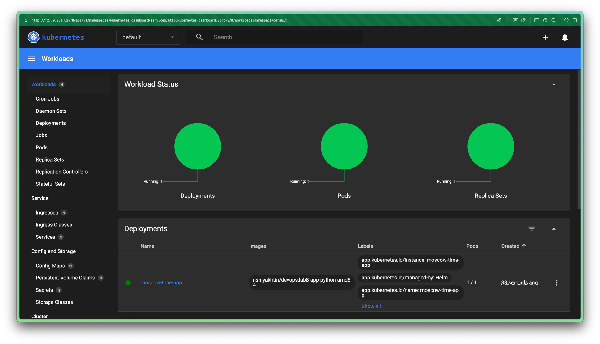

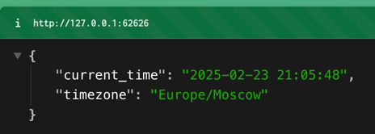

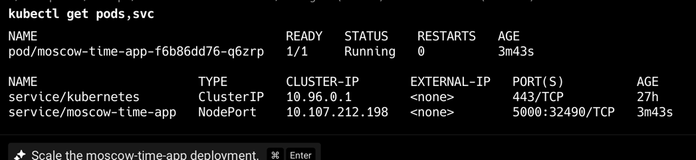

## Task 2: Helm Chart Hooks

The following screenshots demonstate that I successfully implemented
pre-install and post-install Helm Chart Hooks for `moscow-time-app`:

- Linter:

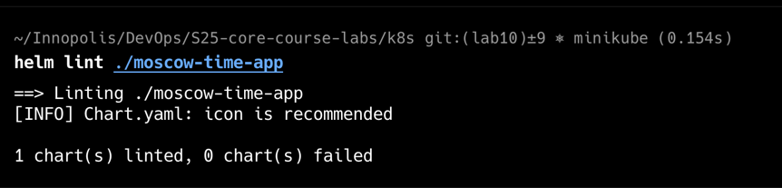

- Install dry-run (the start of the output):
  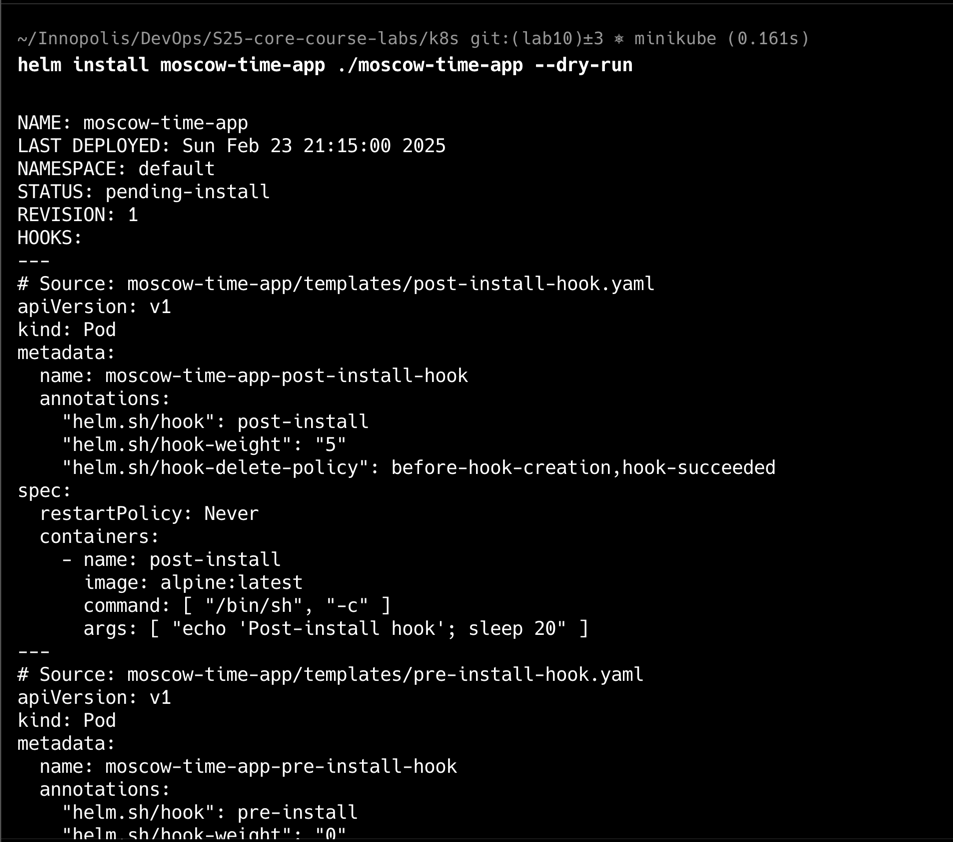

- pre-install pod description (captured when the pod was alive):
  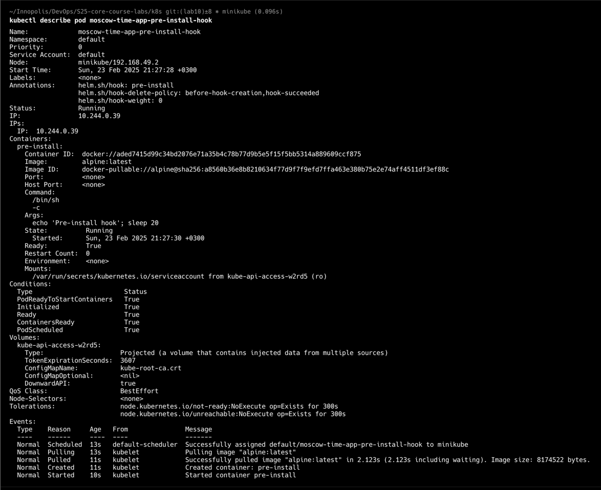

- post-install pod description (captured when the pod was alive):
  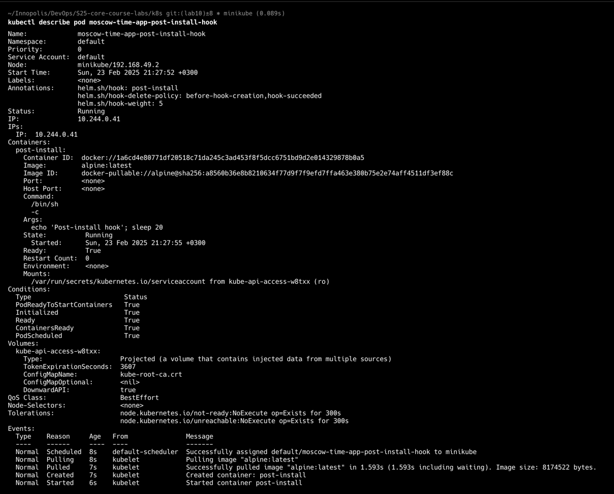

- pre-install, post-install and main applications pods lifecycle:
  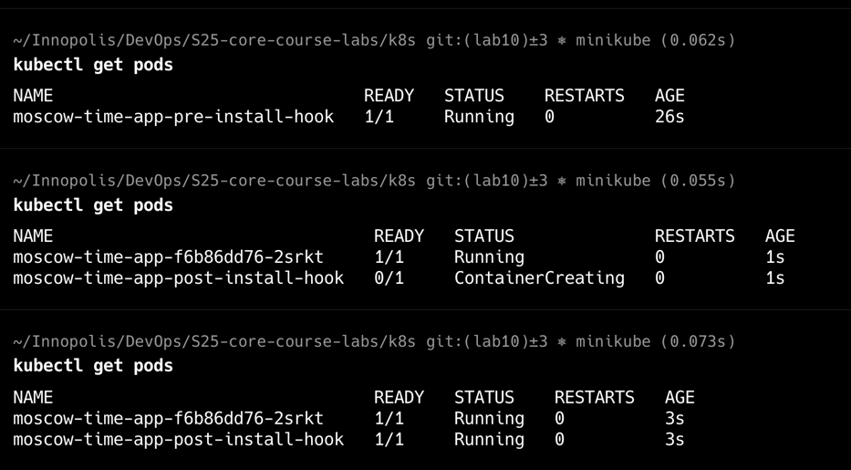
  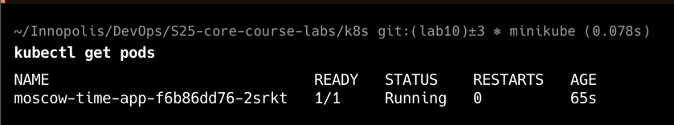
  We can see that firstly pre-install-hook pod was created.
  After 20s main app and post-install-hook pods were created,
  and pre-install-hook pod was deleted.
  After 20s more post-install-hook pod also deleted,
  and only main application pod left

- Final output after all hooks:
  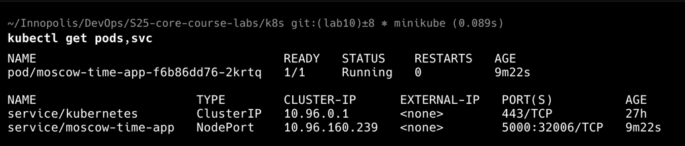
