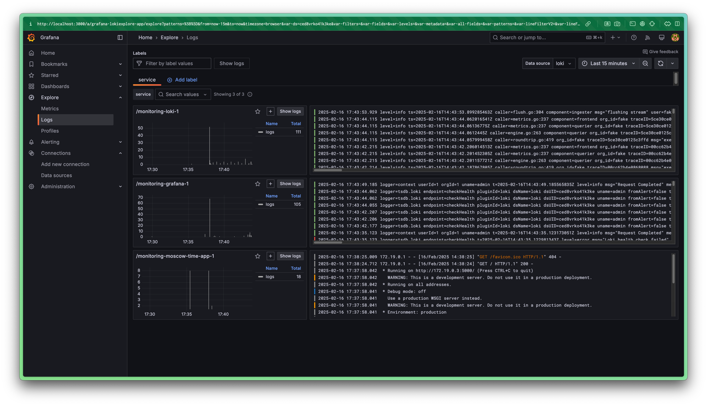
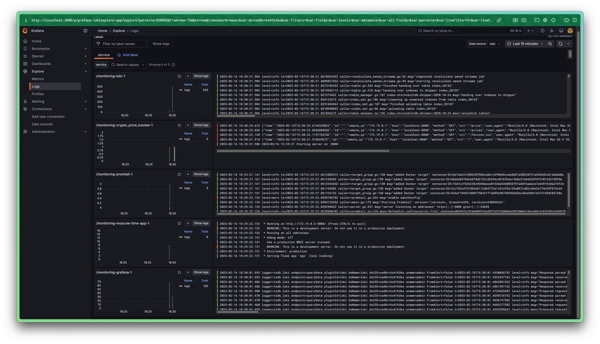

# Logging

## Lab 7: Monitoring and Logging

## Task 2: Documentation and Reporting

### Logging Stack Report

The logging stack consists of three main components:

- Promtail: A log scrapper that collects logs from Docker containers and sends them to Loki
- Loki: A log aggregation system that collects, indexes, and stores logs
- Grafana: A visualization tool that queries and displays logs stored in Loki

#### Promtail

Promtail acts as an agent that collects logs from Docker containers:

- **Scraping Logs**: It uses Docker service discovery (`docker_sd_configs`) to automatically detect running containers.
- **Shipping Logs**: Collected logs are pushed to Loki via its API endpoint (`http://loki:3100/loki/api/v1/push`).

#### Loki

Loki is responsible for receiving, indexing, and storing log data. It listens on port 3100 and
is configured using the `loki-config.yaml` file. In this configuration:

- **Storage and Indexing**: Loki uses the `boltdb-shipper` store to manage log indexes and
  stores log chunks on the filesystem
- **Common Settings**: The `common` section sets the `path_prefix` for all file paths.
- **Compactor**: A compactor is configured with a working directory to handle log compaction tasks.

#### Grafana

Grafana provides a convenient UI to visualize and analyze the logs:

- **Data Source**: Grafana connects to Loki as its data source.
- **Dashboards**: In the provided screenshot, Grafana displays three panels filtered by the `service` label from Loki:
  - **/monitoring-loki-1**: Logs from the Loki container.
        - **/monitoring-grafana-1**: Logs from the Grafana container (including startup logs and admin login events).
        - **/monitoring-moscow-time-app-1**: Logs from the application container (showing a GET request).

#### Application (moscow-time-app)

This container runs the application (built from `app_python`) that generates logs during its operation.
Promtail collects these logs and forwards them to Loki,
making them available for querying and visualization in Grafana

### Screenshots

The screenshot demonstrates the successful operation of the logging stack by showing:

- The Grafana interface with active log panels
- Three panels, each filtered by the `service` label, representing logs from Loki,
  Grafana, and the app_python container
- Each log stream panel shows active logs, such as Loki's startup logs, Grafana's access logs (admin login),
  and the application's GET request logs

## Bonus Task: Additional Configuration

The screenshot demonstrates the successful operation of the logging stack with 
my additional crypto_price_tracker Golang application by showing:

- The Grafana interface with active log panels
- Five panels, each filtered by the `service` label, representing logs from Loki,
  Grafana, Promtail, app_python and app_go containers
- Each log stream panel shows active logs, such as Loki's startup logs, Grafana's access logs (admin login),
  and the application's GET requests logs

