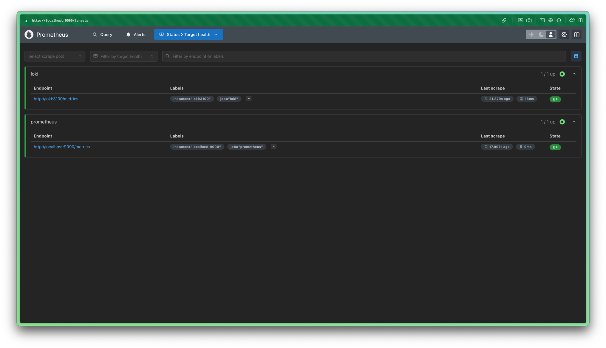
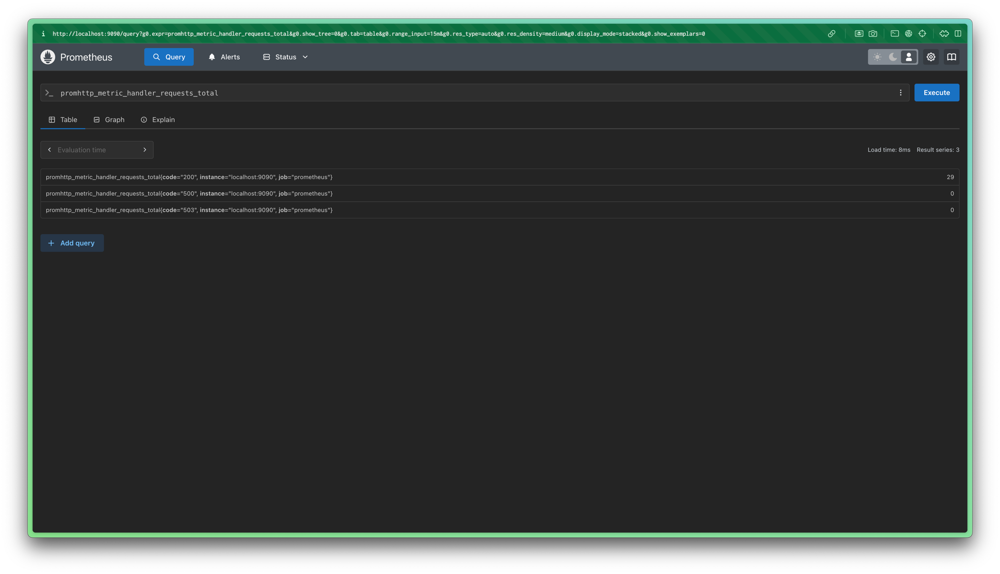
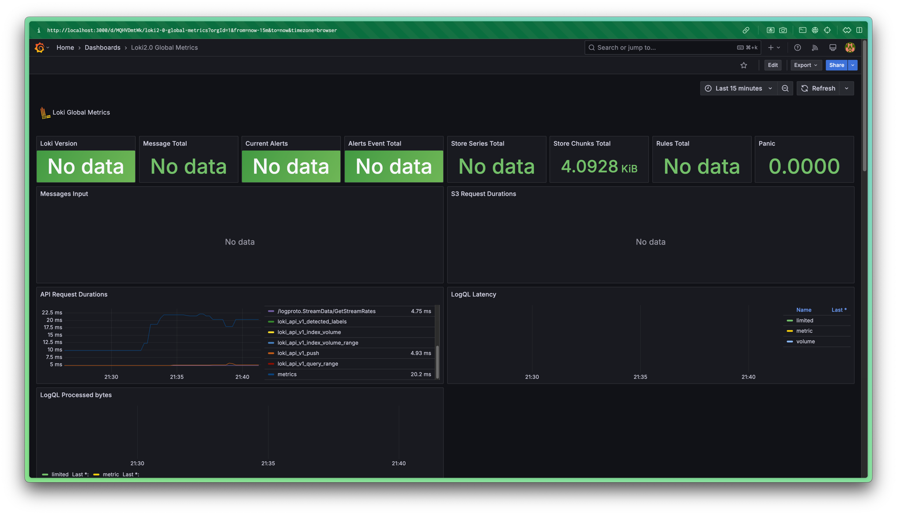
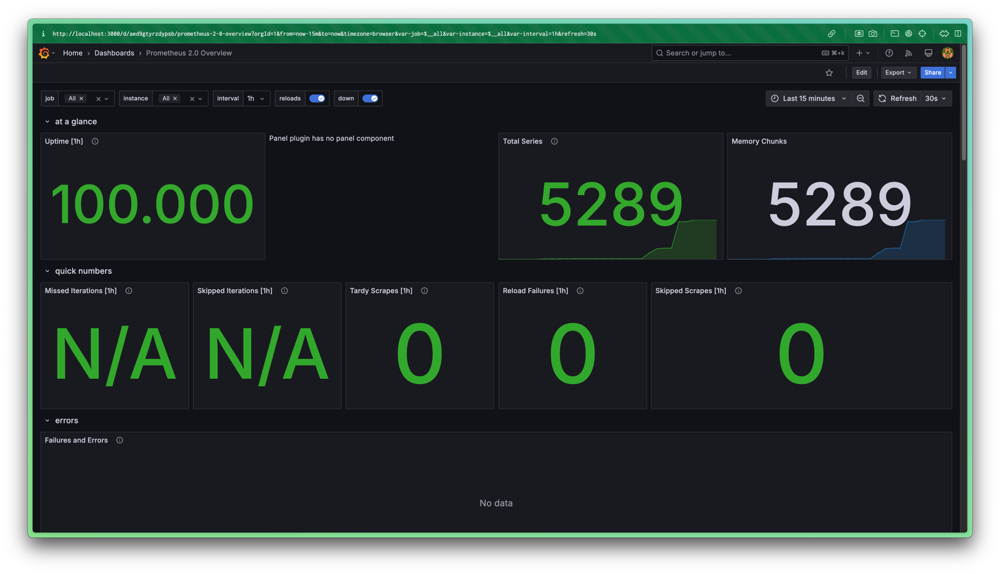
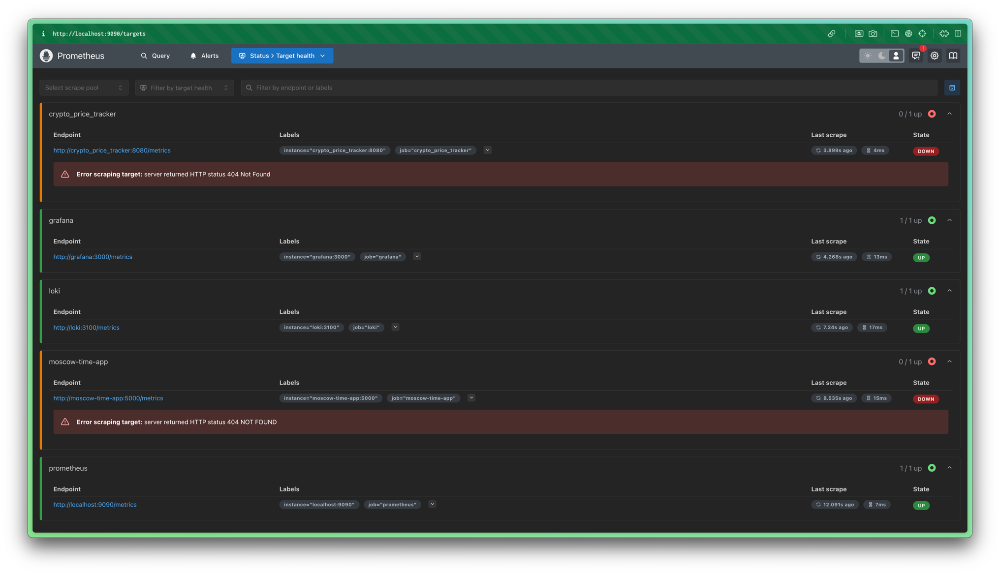
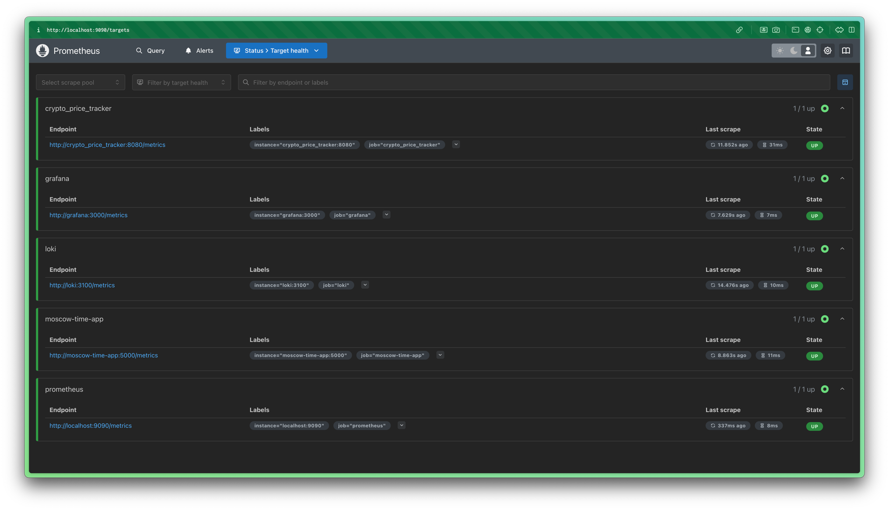
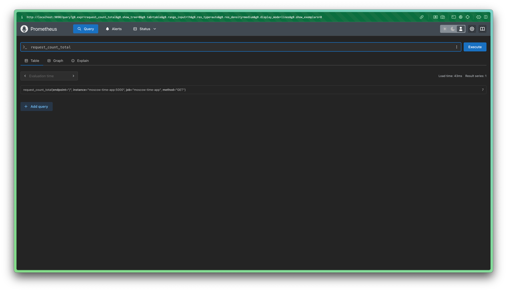
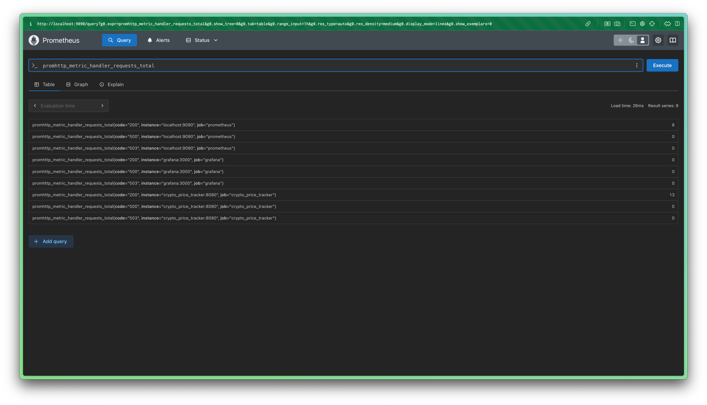

# Metrics

## Lab 8: Monitoring with Prometheus

## Task 1: Prometheus Setup

The following screenshots demonstrates the successful operation of the Monitoring with Prometheus stack.
Now, the Prometheus monitors itself (on `localhost:9090`) and Loki.

The screenshots demonstrate that monitoring is "Up" and we can query
some metrics with `PromQL`:





## Task 2: Dashboard and Configuration Enhancements

The following screenshots demonstrate successful Loki and Prometheus dashboard configurations:





Also, I updated the `docker-compose.yml` file with log rotation and memory limits for each service.

Example configuration for the Loki service:

```yaml
loki:
  image: grafana/loki:3.4.0
  ports:
    - "3100:3100"
  command: -config.file=/etc/loki/local-config.yaml
  volumes:
    - ./loki-config.yaml:/etc/loki/local-config.yaml
  logging:
    driver: "json-file"
    options:
      max-size: "10m"
      max-file: "3"
  deploy:
    resources:
      limits:
        memory: 512M
```

The configurations updated for other services are identical.

The following screenshot from Prometheus targets panel demonstrates that now all services are connected
to Prometheus monitoring. However, Prometheus counts "moscow-time-app" and "crypto_price_tracker"
as down because they don't expose `/metrics` endpoint (yet).



## Bonus Task: Metrics and Health Checks

The following screenshots from Prometheus UI shows that app_python (moscow_time_app)
and app_go (crypto_price_tracker) are properly configured with Prometheus client, up and
provide metrics at `/metrics` endpoint:






