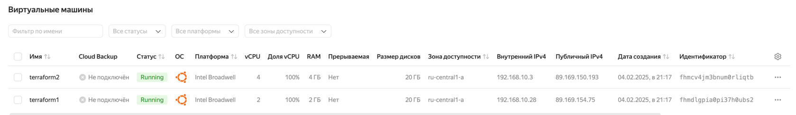

# Infrastructure as Code (IAC) using Terraform

## Lab 4: Infrastructure as Code Lab

### Task 1: Introduction to Terraform

#### Docker Infrastructure Using Terraform

The state of infrastructure after "Build" part of the tutorial:

```tf
> terraform show

# docker_container.nginx:
resource "docker_container" "nginx" {
attach = false
bridge = null
command = [
"nginx",
"-g",
"daemon off;",
]
container_read_refresh_timeout_milliseconds = 15000
cpu_set                                     = null
cpu_shares = 0
domainname = null
entrypoint = [
"/docker-entrypoint.sh",
]
env = []
hostname = "96d08b9071f1"
id = "96d08b9071f18b4fe498e4e19fd7bb07469631b24455bc1935c7896e244f1422"
image = "sha256:781d902f1e046dcb5aba879a2371b2b6494f97bad89f65a2c7308e78f8087670"
init = false
ipc_mode = "private"
log_driver = "json-file"
logs = false
max_retry_count = 0
memory = 0
memory_swap = 0
must_run = true
name = "tutorial"
network_data = [
{
gateway = "172.17.0.1"
global_ipv6_address = null
global_ipv6_prefix_length = 0
ip_address                = "172.17.0.2"
ip_prefix_length = 16
ipv6_gateway = null
mac_address = "02:42:ac:11:00:02"
network_name = "bridge"
},
]
network_mode = "bridge"
pid_mode = null
privileged = false
publish_all_ports = false
read_only = false
remove_volumes = true
restart = "no"
rm = false
runtime = "runc"
security_opts = []
shm_size = 64
start = true
stdin_open        = false
stop_signal = "SIGQUIT"
stop_timeout = 0
tty = false
user = null
userns_mode = null
wait = false
wait_timeout = 60
working_dir = null

ports {
external = 8000
internal = 80
ip = "0.0.0.0"
protocol = "tcp"
}
}

# docker_image.nginx:
resource "docker_image" "nginx" {
id = "sha256:781d902f1e046dcb5aba879a2371b2b6494f97bad89f65a2c7308e78f8087670nginx"
image_id = "sha256:781d902f1e046dcb5aba879a2371b2b6494f97bad89f65a2c7308e78f8087670"
keep_locally = false
name         = "nginx"
repo_digest = "nginx@sha256:0a399eb16751829e1af26fea27b20c3ec28d7ab1fb72182879dcae1cca21206a"
}
```

```tf
> terraform state list

docker_container.nginx
docker_image.nginx
```

---

After changing the nginx external port to 8080 in "Change" part of the tutorial, the execution part changed.
Here is the part of new execution plan:

```tf
  # docker_container.nginx must be replaced
-/+ resource "docker_container" "nginx" {
+ bridge = (known after apply)
~ command                                     = [
- "nginx",
- "-g",
- "daemon off;",
] -> (known after apply)

...

~ ports {
~ external = 8000 -> 8080 # forces replacement
# (3 unchanged attributes hidden)
}
}

Plan : 1 to add, 0 to change, 1 to destroy.
```

The plan shows that Terraform needs to replace `"docker_container"` resource with the updated one
because Terraform can't update the port without destroying and replacing the resource.

---

The output after finishing the tutorial:

```tf
> terraform output

container_id = "dff77058e875a75c8629829d2b7d7ccd9e415edbf0c5c3c96a36e5e0aac4741a"
image_id = "sha256:781d902f1e046dcb5aba879a2371b2b6494f97bad89f65a2c7308e78f8087670nginx"
```

#### Yandex Cloud Infrastructure Using Terraform

I will describe the entire process how I set up cloud infrastructure
using terraform following Yandex Quickstart Guide:

#### Setup Required Tools

1. Installed yc (Yandex Cloud CLI) using homebrew.
1. Created a devops service account and assigned the admin role via the Yandex Cloud web UI.
1. Saved the service account configuration and authentication key to environment variables.

#### Configure Terraform Environment

1. Created a cloud-terraform directory for this setup.
1. Added a .terraformrc config with a network mirror for the Yandex Cloud provider.
1. Created a main.tf file with the infrastructure plan from the tutorial.
1. Locked the Yandex Cloud Terraform provider for windows-amd64 and linux-amd64.
1. Selected an Ubuntu OS image_id using:

    ```sh
    yc compute image list --folder-id standard-images | grep ubuntu-16-04
    ````

1. Generated an SSH key with:

   ```sh
   ssh-keygen -t ed25519 -C "<optional_comment>"
   ```

1. Updated the Terraform template with my SSH public key and the selected image_id for Ubuntu 16.04.
1. Added a meta.txt file with OS metadata and user configuration.

#### Deploy Infrastructure with Terraform

1. Validated the configuration: `terraform validate`
1. Formatted Terraform files: `terraform fmt`
1. Reviewed the execution plan: `terraform plan`
1. Applied the infrastructure setup: `terraform apply`

Execution plan output:

```txt
Apply complete! Resources: 5 added, 0 changed, 3 destroyed.

Outputs:

external_ip_address_vm_1 = "89.169.154.75"
external_ip_address_vm_2 = "89.169.150.193"
internal_ip_address_vm_1 = "192.168.10.28"
internal_ip_address_vm_2 = "192.168.10.3"
```

I can check running VM's in Yandex Cloud UI:



### Task 2: Terraform for GitHub

#### Applied Terraform-related best practices

- Secrets with environment Terraform and environmental variables (not hardcoded)
- Pinned provider versions for stability
- Splitted resources, variables, and outputs
- Main branch protected with PR reviews and rules
- Clear resource naming  
- Usage of `terraform fmt` for consistent code formatting  
